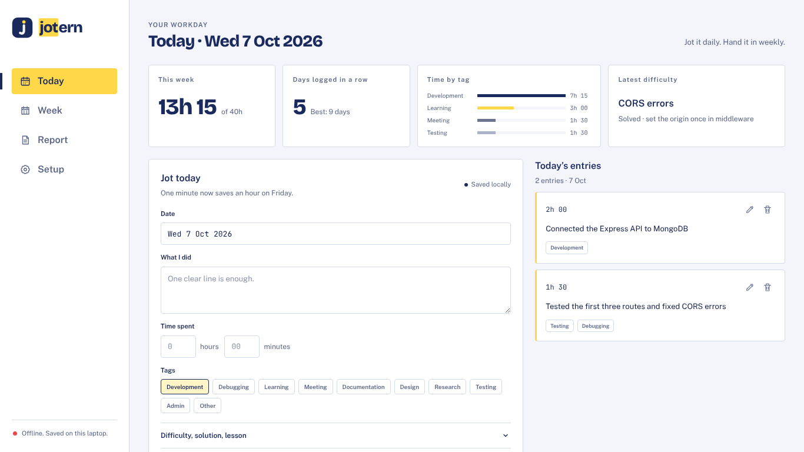
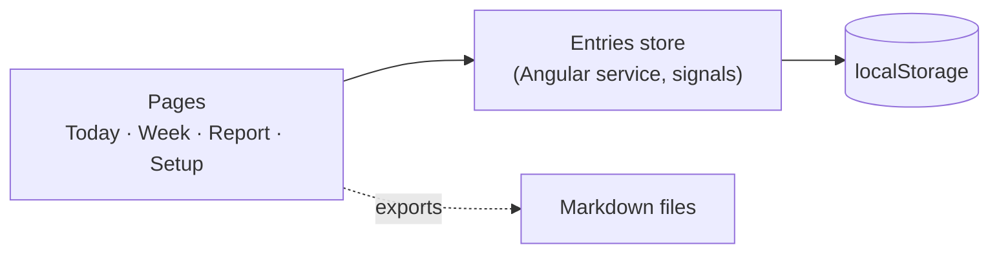

<p align="center"></p>

# Jotern

> **Jot it daily. Hand it in weekly.** A work journal for interns: log each day in under a minute, and Jotern turns your daily logs into weekly summaries and a report outline in your school's format.

**Status:** in development. v1 is due on 2026-10-08 as my end-of-internship project; the app keeps growing after that.

<!-- Screenshot of the dashboard or the week view goes here (demo data only) -->



## What it does (v1)

- Log each day: what I did, time spent, tags, difficulties, how I solved them, what I learned
- See a week: entries by day, total time, time by tag
- Export a week to Markdown
- Build the report outline from your daily logs, using a general report template (v1 ships the ENSPD one)
- A dashboard on the Today page: hours this week, days logged in a row, time by tag, latest difficulties
- Runs entirely on your laptop, no internet needed: your entries stay in your browser

**Coming later:** a backend (an API and a database), a supervisor's side and a shared space (submitted weeks, comments, meeting requests), school tutor and organisation admin roles, dashboards for every role, an installable app that syncs.

## Architecture

v1 is a frontend-only Angular app: no server, no database. The entries are kept in the browser's `localStorage` on your laptop.



| Part         | Stack                          |
| ------------ | ------------------------------ |
| App (`web/`) | Angular, TypeScript, HTML, CSS |
| Data         | The browser's `localStorage`   |

## Requirements

- Node.js LTS (see `.nvmrc`; with nvm: `nvm use`)

## How to run

<!-- Fill in once web/ exists -->

```bash
git clone https://github.com/angelanang/jotern.git
cd jotern/web
npm install
npm start
```

Then open http://localhost:4200.

## Repository layout

```
web/     Angular app (TypeScript)
docs/
  uml/     UML diagrams (Gaphor files and exports)
  design/  Figma exports, the prototype link and the brand kit
```

## Branches

- `main`: the app, written by hand.
- `ai-made`: an earlier AI-assisted version of the interface, kept for reference; not maintained.

## Design and models

- Figma prototype: [To Figma](https://rise-liver-98085590.figma.site)
- UML diagrams: [`docs/uml/`](docs/uml/)
- Brand kit: [`docs/design/brand/`](docs/design/brand/)

## How it's built

Designed in Figma and modeled in UML before coding. All of the app's code on `main` is written by hand; CLI-generated code (`ng new`, `ng generate`) is committed with a `Generated-by: scaffold` trailer so it stays out of the count. The documentation and design files in `docs/` are not counted.

## Author

Find me on [GitHub](https://github.com/angelanang)
