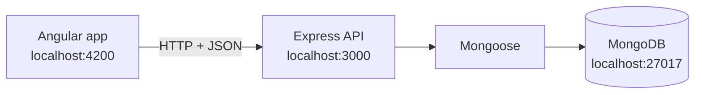

# Internship Log & Report Helper

> A work journal for internships: interns log each day in under a minute, and the app turns it into weekly summaries and a report outline in their own school's format.

**Status:** in development. v1 is due on 2026-10-08 as my end-of-internship project; the app keeps growing after that.

<!-- Screenshot of the dashboard or the week view goes here (demo data only) -->

## What it does (v1)

- Log each day: what I did, time spent, tags, difficulties, how I solved them, what I learned
- See a week: entries by day, total time, time by tag
- Export a week to Markdown
- Export a report outline built from a template (the ENSPD structure by default, or your own school's)
- Runs entirely on your laptop, no internet needed

**Coming later:** a supervisor's side and a shared space (submitted weeks, comments, meeting requests), school tutor and organisation admin roles, dashboards for every role, an installable app that syncs.

## Architecture



| Part | Stack |
|---|---|
| Front end (`web/`) | Angular, TypeScript, HTML, CSS |
| API (`api/`) | Node.js, Express, JavaScript |
| Database | MongoDB with Mongoose |

## Requirements

- Node.js LTS (see `.nvmrc`; with nvm: `nvm use`)
- MongoDB Community Server running on `localhost:27017`

## How to run

<!-- Fill in once api/ and web/ exist -->

```bash
git clone <repository-url>
cd internship-log-report-helper
cp api/.env.example api/.env
npm install            # root: installs the script runner
npm run install:all    # installs api/ and web/
npm run dev            # starts the API and the Angular app
```

Then open http://localhost:4200.

## Repository layout

```
api/     Express API (JavaScript)
web/     Angular app (TypeScript)
docs/
  uml/     UML diagrams (Gaphor files and exports)
  design/  Figma exports and the prototype link
```

## Design and models

- Figma prototype: <!-- link -->
- UML diagrams: [`docs/uml/`](docs/uml/)

## How it's built

Designed in Figma and modeled in UML before coding. At least 70% of the code is written by hand (and at least 60% of each technology's); commits containing AI-written code carry an `Assisted-by: AI` trailer, and CLI-generated code a `Generated-by: scaffold` trailer.

## Author

Angela — <!-- GitHub / LinkedIn link -->

## License

<!-- To decide (MIT is the usual choice for a portfolio project) -->
