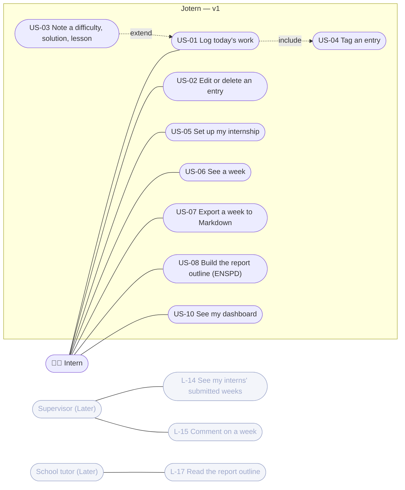
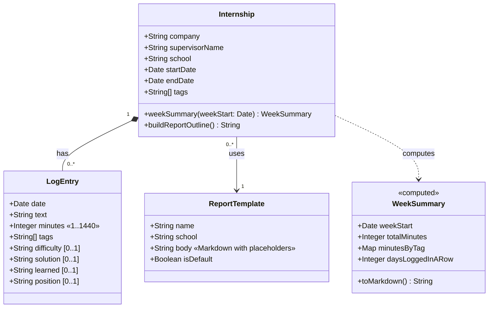
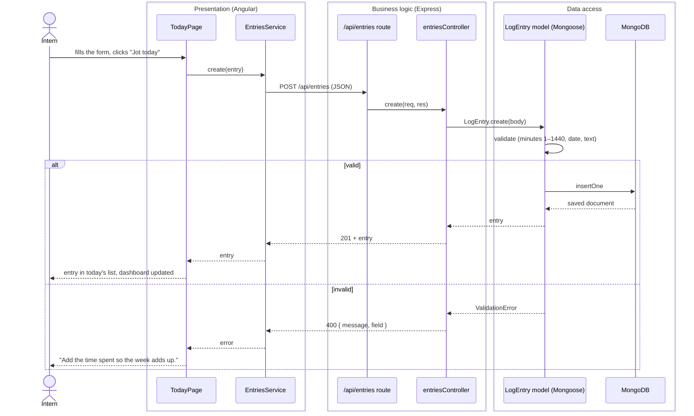
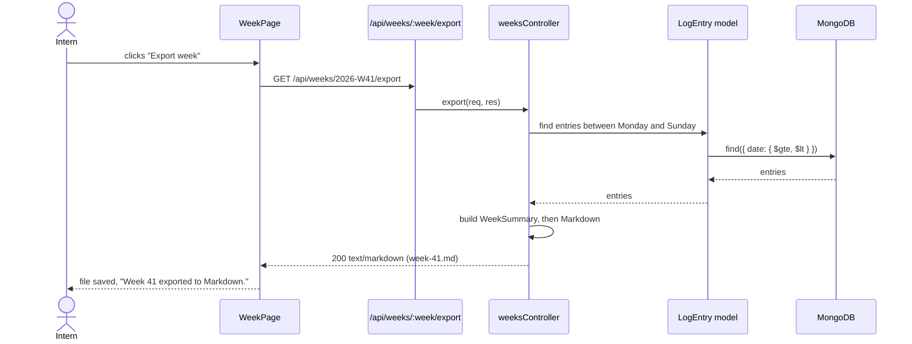

# UML

> **Note (2026-10-06):** v1 is frontend only. The sequence diagrams below still show the API and MongoDB of the full-stack plan; that backend comes later. In v1, the same steps happen inside the app, with the entries saved to `localStorage`.

The diagrams are written in PlantUML (`*.puml`, shared look in `skin.iuml`) and exported as PNG, SVG and one PDF. The Mermaid versions below are quick previews that render on GitHub.

| File | What |
|---|---|
| `jotern-uml.pdf` | The four diagrams in one PDF, bilingual titles |
| `01-use-case.puml` / `.png` / `.svg` | Use case diagram |
| `02-class.puml` / `.png` / `.svg` | Class diagram |
| `03-sequence-add-entry.puml` / `.png` / `.svg` | Sequence: add an entry |
| `04-sequence-export-week.puml` / `.png` / `.svg` | Sequence: export a week |
| `skin.iuml` | The Jotern colours and fonts for PlantUML |
| `jotern-style.css` | The same look as a Gaphor style sheet |

Regenerate: `java -jar plantuml.jar -tsvg docs/uml/*.puml` (and `-tpng` for the PNGs).

## 1. Use case (v1 in colour, Later greyed out)

US-10 sits on the Today page: the dashboard is the first thing the intern sees every day. US-11 (works with no internet) is a non-functional need, so it's a note on the diagram, not a use case. US-09 (paste my own school's template) moved to Later: v1 builds the report from a general template, and the template used now is ENSPD's.

## 2. Class

Two choices made here (change them in Gaphor if you disagree): **tags** are a list on the Internship, so each intern can rename them; **position** is an optional text on each entry, for the ENSPD "par poste" layout. WeekSummary is never stored: the API computes it from the entries.

## 3. Sequence: add an entry

## 4. Sequence: export a week

